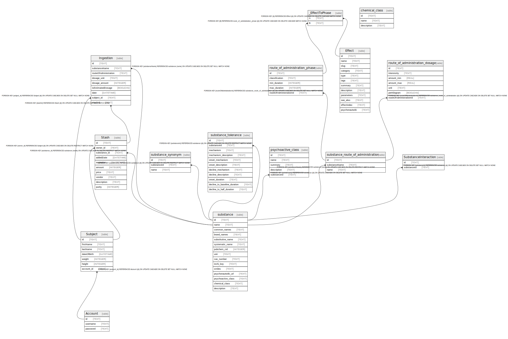

# dev.db

## Tables

| Name | Columns | Comment | Type |
| ---- | ------- | ------- | ---- |
| [Account](Account.md) | 3 |  | table |
| [Subject](Subject.md) | 7 |  | table |
| [substance](substance.md) | 15 |  | table |
| [substance_synonym](substance_synonym.md) | 3 |  | table |
| [substance_tolerance](substance_tolerance.md) | 11 |  | table |
| [chemical_class](chemical_class.md) | 3 |  | table |
| [psychoactive_class](psychoactive_class.md) | 5 |  | table |
| [substance_route_of_administration](substance_route_of_administration.md) | 3 |  | table |
| [route_of_administration_phase](route_of_administration_phase.md) | 5 |  | table |
| [route_of_administration_dosage](route_of_administration_dosage.md) | 7 |  | table |
| [Effect](Effect.md) | 12 |  | table |
| [Ingestion](Ingestion.md) | 9 |  | table |
| [Stash](Stash.md) | 10 |  | table |
| [SubstanceInteraction](SubstanceInteraction.md) | 2 |  | table |
| [_EffectToPhase](_EffectToPhase.md) | 2 |  | table |

## Relations

---

> Generated by [tbls](https://github.com/k1LoW/tbls)
