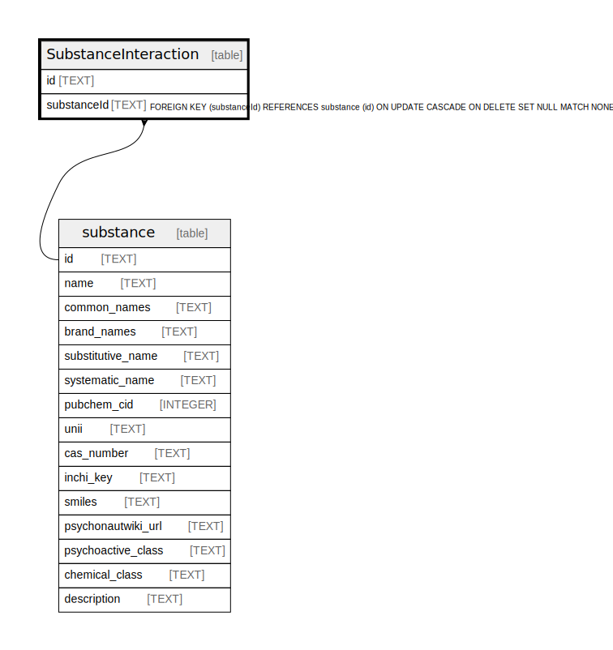

# SubstanceInteraction

## Description

<details>
<summary><strong>Table Definition</strong></summary>

```sql
CREATE TABLE "SubstanceInteraction" (
    "id" TEXT NOT NULL PRIMARY KEY,
    "substanceId" TEXT,
    CONSTRAINT "SubstanceInteraction_substanceId_fkey" FOREIGN KEY ("substanceId") REFERENCES "substance" ("id") ON DELETE SET NULL ON UPDATE CASCADE
)
```

</details>

## Columns

| Name | Type | Default | Nullable | Children | Parents | Comment |
| ---- | ---- | ------- | -------- | -------- | ------- | ------- |
| id | TEXT |  | false |  |  |  |
| substanceId | TEXT |  | true |  | [substance](substance.md) |  |

## Constraints

| Name | Type | Definition |
| ---- | ---- | ---------- |
| id | PRIMARY KEY | PRIMARY KEY (id) |
| - (Foreign key ID: 0) | FOREIGN KEY | FOREIGN KEY (substanceId) REFERENCES substance (id) ON UPDATE CASCADE ON DELETE SET NULL MATCH NONE |
| sqlite_autoindex_SubstanceInteraction_1 | PRIMARY KEY | PRIMARY KEY (id) |

## Indexes

| Name | Definition |
| ---- | ---------- |
| sqlite_autoindex_SubstanceInteraction_1 | PRIMARY KEY (id) |

## Relations



---

> Generated by [tbls](https://github.com/k1LoW/tbls)
