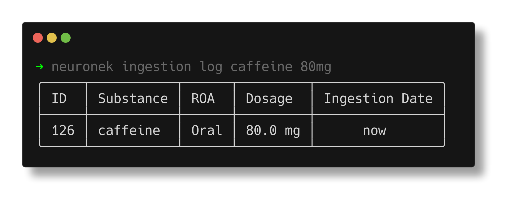

# Neuronek

🧬 Intelligent dosage tracker application for monitoring supplements, nootropics and psychoactive substances along with
their long-term influence on one's mind and body.



## About

Neuronek is an intelligent dosage tracking application designed to monitor and log the use of supplements, nootropics,
and
psychoactive substances. By recording and analyzing ingestion, it helps users better understand the long-term effects
of these compounds on their physical and mental health.

## Getting Started

### Installation

To install the application, please visit the [GitHub Releases Page](https://github.com/keinsell/neuronek/releases) for
pre-built binaries and installation instructions for your platform. Alternatively, you can install the application from
supported package managers or build it from source.

#### Using a package manager (recommended)

> [!WARNING]
> Application is in early stage of development and to avoid polluting package managers with application that can be
> potentially dead in few months I do recommend installing from source or using available pre-build binaries.
> Application will be available for `homebrew`, `pacman`, `nix`, `scoop`, `dnf` and `apt` when it would be considered
> production-ready.

[//]: # (| Operating System           | Package Manager | Easy-peasy command                 |)

[//]: # (|----------------------------|-----------------|------------------------------------|)

[//]: # (| **macOS**                  | Homebrew        | `brew install keinsell/tap/neuronek` |)

[//]: # (| **Windows**                | Scoop           | `scoop install neuronek`             |)

[//]: # (| **Linux &#40;Debian/Ubuntu&#41;**  | APT             | `apt install neuronek`               |)

[//]: # (| **Linux &#40;Arch Linux&#41;**     | Pacman          | `pacman -S neuronek`                 |)

[//]: # (| **Linux &#40;Fedora/CentOS&#41;**  | DNF             | `dnf install neuronek`               |)

[//]: # (| **Linux/NixOS/nix-darwin** | Nix             | `dnf install neuronek`               |)

#### Installation from source (Advanced)

Application can be installed with `cargo` and providing url to this repository,
this may be the most conformable way for users which are looking for the latest version of application.

```
cargo install --git https://github.com/keinsell/neuronek
```

**Note:** This method might be best for users who always want the absolute newest version of the application. However,
it may be less stable than the pre-built binaries.

### Usage

After installation, you can start using the application by running the `psylog` command in your terminal. The
application provides a command-line interface (CLI) for interacting with its features and functionalities.

```bash
❯ neuronek --help
```

## Features

### Ingestions

Ingestions are "low-level" database of ingested compounds, it may seem raw for users however they will be abstracted to
different interfaces, for example user would be able to use command like `psylog a coffee` which will automatically add
necessary ingestions, there will be also human-friendly journal and information-oriented journal with JSON interface to
integrate it with other tools.

#### Log Ingestion

The `Log Ingestion` feature is the core functionality of Psylog,
enabling users to record information about any substances they consume.
This feature is designed for tracking supplements, medications, nootropics,
or any psychoactive substances in a structured and organized way.

By logging ingestion, users can provide details such as the substance name, dosage, and the time of ingestion.
This data is stored in a low-level database that serves as the foundation for further features,
such as journaling, analytics, or integrations with external tools.
While power users may prefer to work directly with this raw data,
many user-friendly abstractions are planned to make this process seamless,
such as simplified commands (e.g., `neuronek a coffee`) for quicker entries.

Logging ingestions not only serves the purpose of record-keeping
but also helps users build a personalized database of their consumption habits.
This database can be used to analyze trends over time,
providing insights into the long-term effects of different substances on physical and mental well-being.

An example usage of the `log ingestion` feature is shown below:

```bash
❯ neuronek ingestion log caffeine 80mg

+----+----------------+--------+----------------------+-------------------------------+
| id | substance_name | route  | dosage               | ingested_at                   |
+----+----------------+--------+----------------------+-------------------------------+
| 1  | caffeine       | "oral" | 79.99999797903001 mg | 2024-12-16 00:02:48.977457    |
+----+----------------+--------+----------------------+-------------------------------+
```

In this example:

- The user logs ingestion of 80 mg of caffeine.
- The system automatically calculates and records a precise dosage, time of ingestion, and assigns a unique entry ID.
- Data saved in this format can be easily retrieved, updated, or removed as needed.

Ultimately, the `Log Ingestion` feature provides a powerful way to centralize all ingestion data,
which can be accessed programmatically (e.g., via JSON) or through additional human-friendly journal views.
Psylog aims to make tracking consumption efficient,
ensuring that users stay informed about their habits and their long-term impact on health.

##### List Ingestions

```bash
❯ neuronek ingestion list

+----+----------------+---------------+----------------------+----------------------------+
| id | substance_name | route         | dosage               | ingested_at                |
+----+----------------+---------------+----------------------+----------------------------+
| 36 | caffeine       | "oral"        | 80 mg                | 2024-12-18 08:14:37.211076 |
+----+----------------+---------------+----------------------+----------------------------+
```

###### Future Notes

- [ ] Listing Ingestions should allow for querying and filtering
- [ ] Listing ingestions should allow for returning data in non-prettified formats (ex. JSON)

##### Get Ingestion

- [ ] Get ingestion should present complete information about single ingestion

##### Update ingestion

The `Update Ingestion` feature allows users to modify existing ingestion records after they've been created. All fields
except `id` and `created_at` can be updated, providing flexibility in maintaining accurate records. This is particularly
useful when correcting data entry errors or adding additional information to an existing record.

Users can update ingestions using the following command structure:
```neuronek ingestion update <id> [options]```

Available update options:

- `-d, --dosage`: Modify the substance dosage
- `-r, --route`: Change the route of administration
- `-s, --substance`: Update the substance name
- `-t, --time`: Adjust the ingestion timestamp (can be represented in a relative format eg. "now" or "1 hour ago")

```bash
❯ neuronek ingestion list

+----+----------------+---------------+----------------------+----------------------------+
| id | substance_name | route         | dosage               | ingested_at                |
+----+----------------+---------------+----------------------+----------------------------+
| 36 | caffeine       | "oral"        | 80 mg               | 2024-12-18 08:14:37.211076 |
+----+----------------+---------------+----------------------+----------------------------+

❯ psylog ingestion update 36 -d 200mg

+----+----------------+---------------+----------------------+----------------------------+
| id | substance_name | route         | dosage               | ingested_at                |
+----+----------------+---------------+----------------------+----------------------------+
| 36 | caffeine       | "oral"        | 200 mg               | 2024-12-18 08:14:37.211076 |
+----+----------------+---------------+----------------------+----------------------------+
```

##### Delete Ingestion

The `Delete Ingestion` feature allows you to remove specific ingestion records from your tracking history using their
unique ID. Here's how it works:

Command syntax:

```
neuronek ingestion delete <id>
```

Example usage:

```bash
# View current ingestions
❯ neuronek ingestion list
+----+----------------+--------+----------+----------------------------+
| id | substance_name | route  | dosage   | ingested_at                |
+----+----------------+--------+----------+----------------------------+
| 36 | caffeine       | "oral" | 80 mg    | 2024-12-18 08:14:37.211076 |
+----+----------------+--------+----------+----------------------------+

# Delete ingestion with ID 36
❯ neuronek ingestion delete 36
```

The command removes the specified ingestion record permanently. Verify deletion by running `psylog ingestion list`
again. This feature is useful for removing incorrect entries or maintaining data accuracy in your tracking history.

Note: Deletion cannot be undone, so verify the correct ID before deleting.

### Substances

Application comes with pre-bundled database of psychoactive substances built on top
of [PsychonautWiki](https://psychonautwiki.org), such information are easily queryable through CLI and are foundation
for further analysis of user's ingestions to provide insight on harm-reduction and predicting subjective effects.

#### Find Substance

TODO: Feature should use humanized search index which will allow for typos and words with same meaning (common names).

#### Get Substance

TODO: Show all information about substance in way ingest-able for end-user which should be able to learn dosages, routes
of administration and maybe overall description of substance.

### FUTURE: Journal

Journal is a feature which aims to compose *ingestion-related* and *substance-related* features of application into
friendly human interface.

- Usecase: Logging ingestions of capsules and pills which may contain multiple substances.
- Usecase: Ingestion planning when it's possible - users should be informed how long it takes for substance to get into
  body and how long it will last.

## Futher Development

*Roadmap is a subject to change and one that is presented here is a high-level overview of direction of the project.*

neuronek is an ongoing project with many planned features and improvements. Some of the key areas of development
include:

- **Journaling**: A user-friendly interface for creating and managing journal entries related to ingestions, thoughts,
  and experiences.
- **Terminal User Interface**: Friendly and efficient interactive interface for terminal application.
- **Web Application**
- **Desktop/Mobile Application**
- **Cloud Sync**

## Contributing

Project do not expect any external contribution. If you want to contribute, please contact me directly
via [keinsell@protonmail.com]() and we can discuss the project together and move code to
organization out of my profile.

See [CONTRIBUTING.md](CONTRIBUTING.md) for more information.

## License

Read the [LICENSE](LICENSE) file for more information.
