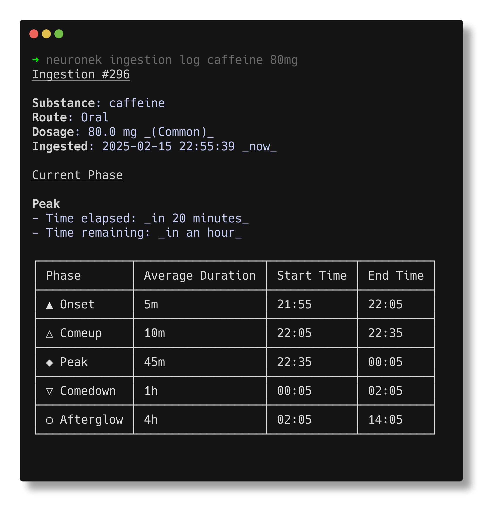

# Neuronek

🧬 Intelligent dosage tracker application for monitoring supplements, nootropics and psychoactive substances along with
their long-term influence on one's mind and body.



## About

Neuronek is an intelligent dosage tracking application designed to monitor and log the use of supplements, nootropics,
and
psychoactive substances. By recording and analyzing ingestion, it helps users better understand the long-term effects
of these compounds on their physical and mental health.

Features offered by application include:

- **Ingestion journaling** with set of commands which allows for inserting, updating, retrieving and deleting all of the
  data stored as `Ingestion` model.

## Installation

To install the application, please visit the [GitHub Releases Page](https://github.com/keinsell/neuronek/releases) for
pre-built binaries and installation instructions for your platform. Alternatively, you can install the application from
supported package managers or build it from source.

#### Using a package manager (recommended)

> [!WARNING]
> Application is in early stage of development and to avoid polluting package managers with application that can be
> potentially dead in few months I do recommend installing from source or using available pre-build binaries.
> Application will be available for `homebrew`, `pacman`, `nix`, `scoop`, `dnf` and `apt` when it would be considered
> production-ready.

#### Installation from source (Advanced)

Application can be installed with `cargo` and providing url to this repository,
this may be the most conformable way for users which are looking for the latest version of application.

```
cargo install --git https://github.com/keinsell/neuronek
```

**Note:** This method might be best for users who always want the absolute newest version of the application. However,
it may be less stable than the pre-built binaries.

```bash
❯ neuronek --help
```

## Usage

### Ingestion Journaling

Ingestions are fundamental area of application, they represent human interaction with chemical compound of choice.
Ingestion explains what compound was ingested, how it was ingested and when it was ingested. Application expose simple,
scriptable interface which allows for storage and retrieval of structured data.

#### [🗎 Log Ingestion](https://keinsell.youtrack.cloud/articles/NEU-A-3)

```bash
❯ neuronek ingestion log caffeine 80mg

+----+----------------+--------+----------------------+-------------------------------+
| id | substance_name | route  | dosage               | ingested_at                   |
+----+----------------+--------+----------------------+-------------------------------+
| 1  | caffeine       | "oral" | 80 mg                | 2024-12-16 00:02:48.977457    |
+----+----------------+--------+----------------------+-------------------------------+
```

#### [🗎 List Ingestions](https://keinsell.youtrack.cloud/articles/NEU-A-7)

```bash
❯ neuronek ingestion list

+----+----------------+---------------+----------------------+----------------------------+
| id | substance_name | route         | dosage               | ingested_at                |
+----+----------------+---------------+----------------------+----------------------------+
| 36 | caffeine       | "oral"        | 80 mg                | 2024-12-18 08:14:37.211076 |
+----+----------------+---------------+----------------------+----------------------------+
```

#### [🗎 Update ingestion](https://keinsell.youtrack.cloud/articles/NEU-A-6)

```bash
❯ neuronek ingestion list

+----+----------------+---------------+----------------------+----------------------------+
| id | substance_name | route         | dosage               | ingested_at                |
+----+----------------+---------------+----------------------+----------------------------+
| 36 | caffeine       | "oral"        | 80  mg               | 2024-12-18 08:14:37.211076 |
+----+----------------+---------------+----------------------+----------------------------+

❯ neuronek ingestion update 36 -d 200mg

+----+----------------+---------------+----------------------+----------------------------+
| id | substance_name | route         | dosage               | ingested_at                |
+----+----------------+---------------+----------------------+----------------------------+
| 36 | caffeine       | "oral"        | 200 mg               | 2024-12-18 08:14:37.211076 |
+----+----------------+---------------+----------------------+----------------------------+
```

#### [🗎 Delete Ingestion](https://keinsell.youtrack.cloud/articles/NEU-A-4)

> [!CAUTION]
> Deletion cannot be undone, so verify the correct ID before deleting.

```bash
❯ neuronek ingestion list
 
+----+----------------+--------+----------+----------------------------+
| id | substance_name | route  | dosage   | ingested_at                |
+----+----------------+--------+----------+----------------------------+
| 36 | caffeine       | "oral" | 80 mg    | 2024-12-18 08:14:37.211076 |
+----+----------------+--------+----------+----------------------------+

❯ neuronek ingestion delete 36
```

### Substances

Application comes with pre-bundled database of psychoactive substances built on top
of [PsychonautWiki](https://psychonautwiki.org), such information are easily queryable through CLI and are foundation
for further analysis of user's ingestions to provide insight on harm-reduction and predicting subjective effects.


#### Get Substance

Application can preview information about compounds from initally provided dataset, however human-interface is a subject to change.

```bash
neuronek substance get caffeine
```

```
┌─────────────┬──────────────────────────────┬──────────────────────────────┐
│                            Substance: Caffeine                            │
├─────────────┼──────────────────────────────┼──────────────────────────────┤
│ Route       │ Dosage Information           │ Duration Information         │
├─────────────┼──────────────────────────────┼──────────────────────────────┤
│ Oral        │ Light:    20.0 mg - 50.0 mg  │ Comeup:     PT10M - PT30M    │
│             │ Medium:   50.0 mg - 150 mg   │ Peak:       PT45M - PT1H30M  │
│             │ Threshold:      -∞ - 10.0 mg │ Comedown:    PT1H - PT2H     │
│             │ Strong:    150 mg - 500 mg   │ Onset:       PT5M - PT10M    │
│             │ Heavy:     500 mg - ∞        │ Afterglow:    PT4H - PT12H   │
├─────────────┼──────────────────────────────┼──────────────────────────────┤
│ Insufflated │ Light:    10.0 mg - 25.0 mg  │ Peak:       PT30M - PT1H     │
│             │ Medium:   25.0 mg - 40.0 mg  │ Comeup:     PT30S - PT2M     │
│             │ Heavy:    80.0 mg - ∞        │ Comedown:    PT6H - PT10H    │
│             │ Threshold:      -∞ - 2.50 mg │ Afterglow:    PT6H - P1D     │
│             │ Strong:   40.0 mg - 80.0 mg  │ Onset:      PT30S - PT2M     │
└─────────────┴──────────────────────────────┴──────────────────────────────┘
```

### Ingestion Analyzer

```bash
neuronek analyzer -s caffeine -d 60mg
```

```
Ingestion Analysis: Caffeine 60.0 mg

Progress: [░░░░░░░░░░░░░░░░░░░░░░░░░░░░░░] 0.00%

○ Ingested: in an hour
○ Onset starts in an hour
○ Comeup starts in an hour
○ Peak starts in an hour
○ Comedown starts in 2 hours
○ Afterglow starts in 2 hours
Dosage Classification: Medium
```

### Journal

Journal is a experimental feature which composes human-friendly interface for showing time-sensetive events by combining major application features (analyzer, ingestions, substances). UI is subject to change.

```bash
neuronek journal
```

```
│
● 30 seconds ago ingestion 136 (40.0 mg caffeine via oral) [0%]
│
● 2 hours ago ingestion 135 (40.0 mg caffeine via oral) [63%]
│
● 4 hours ago ingestion 134 (40.0 mg caffeine via oral) [74%]
│
│ 6 past ingestions collapsed
```

## Futher Development

*Roadmap is a subject to change and one that is presented here is a high-level overview of direction of the project.*

neuronek is an ongoing project with many planned features and improvements. Some of the key areas of development
include:

- **Journaling**: A user-friendly interface for creating and managing journal entries related to ingestions, thoughts,
  and experiences.
- **Terminal User Interface**: Friendly and efficient interactive interface for terminal application.
- **Web Application**
- **Desktop/Mobile Application**
- **Cloud Sync**

## Contributing

Project do not expect any external contribution. If you want to contribute, please contact me directly
via [keinsell@protonmail.com]() and we can discuss the project together and move code to
organization out of my profile.

See [CONTRIBUTING.md](CONTRIBUTING.md) for more information.

## License

Read the [LICENSE](LICENSE) file for more information.
