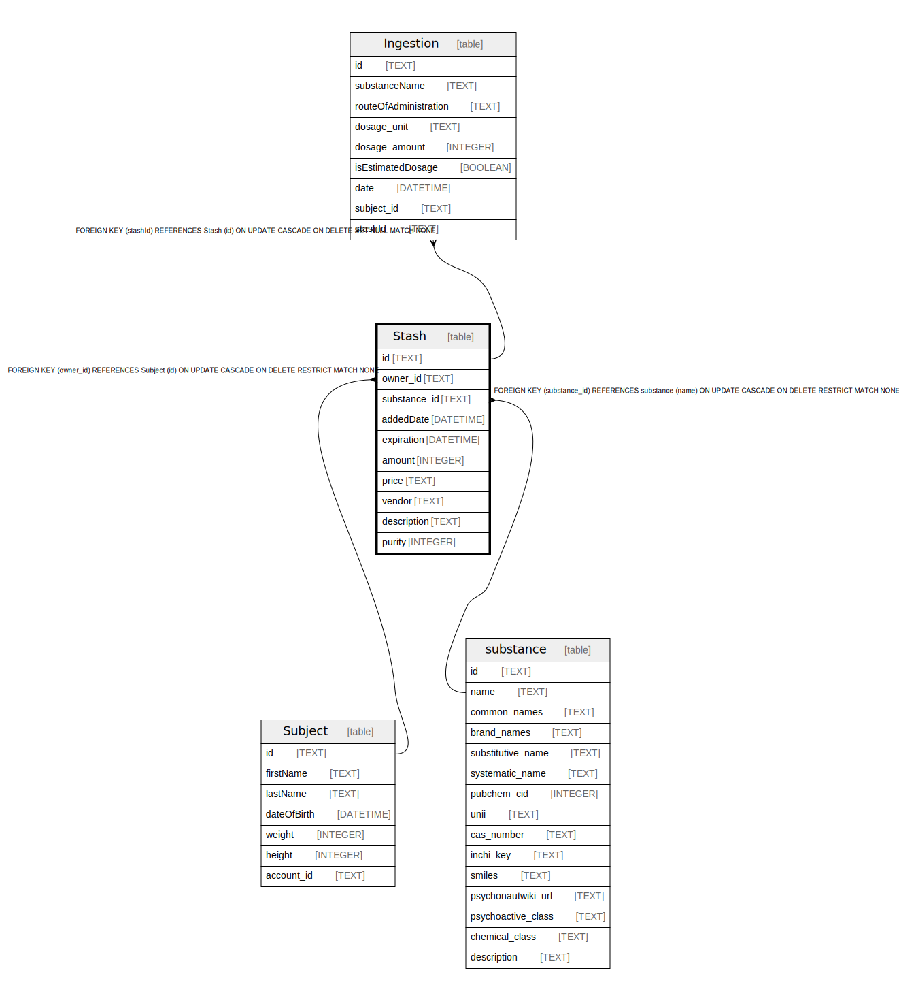

# Stash

## Description

<details>
<summary><strong>Table Definition</strong></summary>

```sql
CREATE TABLE "Stash" (
    "id" TEXT NOT NULL PRIMARY KEY,
    "owner_id" TEXT NOT NULL,
    "substance_id" TEXT NOT NULL,
    "addedDate" DATETIME DEFAULT CURRENT_TIMESTAMP,
    "expiration" DATETIME,
    "amount" INTEGER,
    "price" TEXT,
    "vendor" TEXT,
    "description" TEXT,
    "purity" INTEGER DEFAULT 100,
    CONSTRAINT "Stash_owner_id_fkey" FOREIGN KEY ("owner_id") REFERENCES "Subject" ("id") ON DELETE RESTRICT ON UPDATE CASCADE,
    CONSTRAINT "Stash_substance_id_fkey" FOREIGN KEY ("substance_id") REFERENCES "substance" ("name") ON DELETE RESTRICT ON UPDATE CASCADE
)
```

</details>

## Columns

| Name | Type | Default | Nullable | Children | Parents | Comment |
| ---- | ---- | ------- | -------- | -------- | ------- | ------- |
| id | TEXT |  | false | [Ingestion](Ingestion.md) |  |  |
| owner_id | TEXT |  | false |  | [Subject](Subject.md) |  |
| substance_id | TEXT |  | false |  | [substance](substance.md) |  |
| addedDate | DATETIME | CURRENT_TIMESTAMP | true |  |  |  |
| expiration | DATETIME |  | true |  |  |  |
| amount | INTEGER |  | true |  |  |  |
| price | TEXT |  | true |  |  |  |
| vendor | TEXT |  | true |  |  |  |
| description | TEXT |  | true |  |  |  |
| purity | INTEGER | 100 | true |  |  |  |

## Constraints

| Name | Type | Definition |
| ---- | ---- | ---------- |
| id | PRIMARY KEY | PRIMARY KEY (id) |
| - (Foreign key ID: 0) | FOREIGN KEY | FOREIGN KEY (substance_id) REFERENCES substance (name) ON UPDATE CASCADE ON DELETE RESTRICT MATCH NONE |
| - (Foreign key ID: 1) | FOREIGN KEY | FOREIGN KEY (owner_id) REFERENCES Subject (id) ON UPDATE CASCADE ON DELETE RESTRICT MATCH NONE |
| sqlite_autoindex_Stash_1 | PRIMARY KEY | PRIMARY KEY (id) |

## Indexes

| Name | Definition |
| ---- | ---------- |
| sqlite_autoindex_Stash_1 | PRIMARY KEY (id) |

## Relations



---

> Generated by [tbls](https://github.com/k1LoW/tbls)
