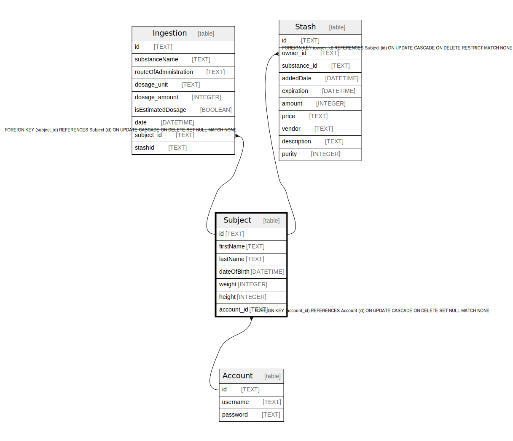

# Subject

## Description

<details>
<summary><strong>Table Definition</strong></summary>

```sql
CREATE TABLE "Subject" (
    "id" TEXT NOT NULL PRIMARY KEY,
    "firstName" TEXT,
    "lastName" TEXT,
    "dateOfBirth" DATETIME,
    "weight" INTEGER,
    "height" INTEGER,
    "account_id" TEXT,
    CONSTRAINT "Subject_account_id_fkey" FOREIGN KEY ("account_id") REFERENCES "Account" ("id") ON DELETE SET NULL ON UPDATE CASCADE
)
```

</details>

## Columns

| Name | Type | Default | Nullable | Children | Parents | Comment |
| ---- | ---- | ------- | -------- | -------- | ------- | ------- |
| id | TEXT |  | false | [Ingestion](Ingestion.md) [Stash](Stash.md) |  |  |
| firstName | TEXT |  | true |  |  |  |
| lastName | TEXT |  | true |  |  |  |
| dateOfBirth | DATETIME |  | true |  |  |  |
| weight | INTEGER |  | true |  |  |  |
| height | INTEGER |  | true |  |  |  |
| account_id | TEXT |  | true |  | [Account](Account.md) |  |

## Constraints

| Name | Type | Definition |
| ---- | ---- | ---------- |
| id | PRIMARY KEY | PRIMARY KEY (id) |
| - (Foreign key ID: 0) | FOREIGN KEY | FOREIGN KEY (account_id) REFERENCES Account (id) ON UPDATE CASCADE ON DELETE SET NULL MATCH NONE |
| sqlite_autoindex_Subject_1 | PRIMARY KEY | PRIMARY KEY (id) |

## Indexes

| Name | Definition |
| ---- | ---------- |
| Subject_account_id_key | CREATE UNIQUE INDEX "Subject_account_id_key" ON "Subject"("account_id") |
| sqlite_autoindex_Subject_1 | PRIMARY KEY (id) |

## Relations



---

> Generated by [tbls](https://github.com/k1LoW/tbls)
