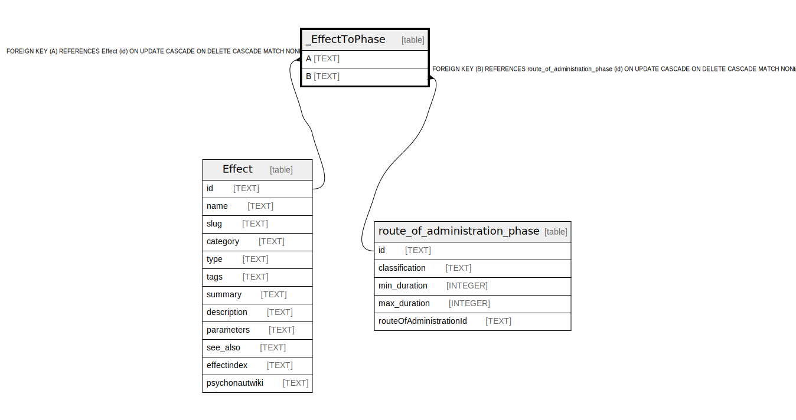

# _EffectToPhase

## Description

<details>
<summary><strong>Table Definition</strong></summary>

```sql
CREATE TABLE "_EffectToPhase" (
    "A" TEXT NOT NULL,
    "B" TEXT NOT NULL,
    CONSTRAINT "_EffectToPhase_A_fkey" FOREIGN KEY ("A") REFERENCES "Effect" ("id") ON DELETE CASCADE ON UPDATE CASCADE,
    CONSTRAINT "_EffectToPhase_B_fkey" FOREIGN KEY ("B") REFERENCES "route_of_administration_phase" ("id") ON DELETE CASCADE ON UPDATE CASCADE
)
```

</details>

## Columns

| Name | Type | Default | Nullable | Children | Parents | Comment |
| ---- | ---- | ------- | -------- | -------- | ------- | ------- |
| A | TEXT |  | false |  | [Effect](Effect.md) |  |
| B | TEXT |  | false |  | [route_of_administration_phase](route_of_administration_phase.md) |  |

## Constraints

| Name | Type | Definition |
| ---- | ---- | ---------- |
| - (Foreign key ID: 0) | FOREIGN KEY | FOREIGN KEY (B) REFERENCES route_of_administration_phase (id) ON UPDATE CASCADE ON DELETE CASCADE MATCH NONE |
| - (Foreign key ID: 1) | FOREIGN KEY | FOREIGN KEY (A) REFERENCES Effect (id) ON UPDATE CASCADE ON DELETE CASCADE MATCH NONE |

## Indexes

| Name | Definition |
| ---- | ---------- |
| _EffectToPhase_B_index | CREATE INDEX "_EffectToPhase_B_index" ON "_EffectToPhase"("B") |
| _EffectToPhase_AB_unique | CREATE UNIQUE INDEX "_EffectToPhase_AB_unique" ON "_EffectToPhase"("A", "B") |

## Relations



---

> Generated by [tbls](https://github.com/k1LoW/tbls)
