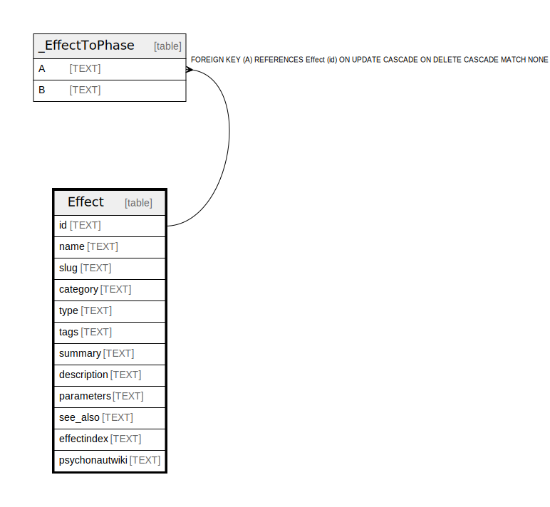

# Effect

## Description

<details>
<summary><strong>Table Definition</strong></summary>

```sql
CREATE TABLE "Effect" (
    "id" TEXT NOT NULL PRIMARY KEY,
    "name" TEXT NOT NULL,
    "slug" TEXT NOT NULL,
    "category" TEXT,
    "type" TEXT,
    "tags" TEXT NOT NULL,
    "summary" TEXT,
    "description" TEXT NOT NULL,
    "parameters" TEXT NOT NULL,
    "see_also" TEXT NOT NULL,
    "effectindex" TEXT,
    "psychonautwiki" TEXT
)
```

</details>

## Columns

| Name | Type | Default | Nullable | Children | Parents | Comment |
| ---- | ---- | ------- | -------- | -------- | ------- | ------- |
| id | TEXT |  | false | [_EffectToPhase](_EffectToPhase.md) |  |  |
| name | TEXT |  | false |  |  |  |
| slug | TEXT |  | false |  |  |  |
| category | TEXT |  | true |  |  |  |
| type | TEXT |  | true |  |  |  |
| tags | TEXT |  | false |  |  |  |
| summary | TEXT |  | true |  |  |  |
| description | TEXT |  | false |  |  |  |
| parameters | TEXT |  | false |  |  |  |
| see_also | TEXT |  | false |  |  |  |
| effectindex | TEXT |  | true |  |  |  |
| psychonautwiki | TEXT |  | true |  |  |  |

## Constraints

| Name | Type | Definition |
| ---- | ---- | ---------- |
| id | PRIMARY KEY | PRIMARY KEY (id) |
| sqlite_autoindex_Effect_1 | PRIMARY KEY | PRIMARY KEY (id) |

## Indexes

| Name | Definition |
| ---- | ---------- |
| Effect_slug_key | CREATE UNIQUE INDEX "Effect_slug_key" ON "Effect"("slug") |
| Effect_name_key | CREATE UNIQUE INDEX "Effect_name_key" ON "Effect"("name") |
| sqlite_autoindex_Effect_1 | PRIMARY KEY (id) |

## Relations



---

> Generated by [tbls](https://github.com/k1LoW/tbls)
