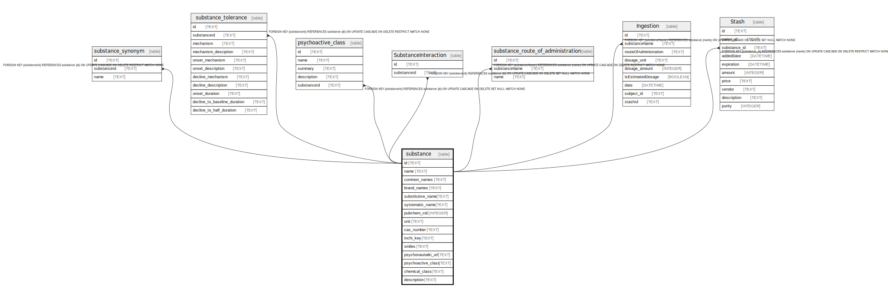

# substance

## Description

<details>
<summary><strong>Table Definition</strong></summary>

```sql
CREATE TABLE "substance" (
    "id" TEXT NOT NULL PRIMARY KEY,
    "name" TEXT NOT NULL,
    "common_names" TEXT NOT NULL,
    "brand_names" TEXT NOT NULL,
    "substitutive_name" TEXT,
    "systematic_name" TEXT NOT NULL,
    "pubchem_cid" INTEGER NOT NULL,
    "unii" TEXT,
    "cas_number" TEXT,
    "inchi_key" TEXT NOT NULL,
    "smiles" TEXT NOT NULL,
    "psychonautwiki_url" TEXT,
    "psychoactive_class" TEXT NOT NULL,
    "chemical_class" TEXT,
    "description" TEXT
)
```

</details>

## Columns

| Name | Type | Default | Nullable | Children | Parents | Comment |
| ---- | ---- | ------- | -------- | -------- | ------- | ------- |
| id | TEXT |  | false | [substance_synonym](substance_synonym.md) [substance_tolerance](substance_tolerance.md) [psychoactive_class](psychoactive_class.md) [SubstanceInteraction](SubstanceInteraction.md) |  |  |
| name | TEXT |  | false | [substance_route_of_administration](substance_route_of_administration.md) [Ingestion](Ingestion.md) [Stash](Stash.md) |  |  |
| common_names | TEXT |  | false |  |  |  |
| brand_names | TEXT |  | false |  |  |  |
| substitutive_name | TEXT |  | true |  |  |  |
| systematic_name | TEXT |  | false |  |  |  |
| pubchem_cid | INTEGER |  | false |  |  |  |
| unii | TEXT |  | true |  |  |  |
| cas_number | TEXT |  | true |  |  |  |
| inchi_key | TEXT |  | false |  |  |  |
| smiles | TEXT |  | false |  |  |  |
| psychonautwiki_url | TEXT |  | true |  |  |  |
| psychoactive_class | TEXT |  | false |  |  |  |
| chemical_class | TEXT |  | true |  |  |  |
| description | TEXT |  | true |  |  |  |

## Constraints

| Name | Type | Definition |
| ---- | ---- | ---------- |
| id | PRIMARY KEY | PRIMARY KEY (id) |
| sqlite_autoindex_substance_1 | PRIMARY KEY | PRIMARY KEY (id) |

## Indexes

| Name | Definition |
| ---- | ---------- |
| substance_smiles_key | CREATE UNIQUE INDEX "substance_smiles_key" ON "substance"("smiles") |
| substance_inchi_key_key | CREATE UNIQUE INDEX "substance_inchi_key_key" ON "substance"("inchi_key") |
| substance_cas_number_key | CREATE UNIQUE INDEX "substance_cas_number_key" ON "substance"("cas_number") |
| substance_pubchem_cid_key | CREATE UNIQUE INDEX "substance_pubchem_cid_key" ON "substance"("pubchem_cid") |
| substance_systematic_name_key | CREATE UNIQUE INDEX "substance_systematic_name_key" ON "substance"("systematic_name") |
| substance_substitutive_name_key | CREATE UNIQUE INDEX "substance_substitutive_name_key" ON "substance"("substitutive_name") |
| substance_name_key | CREATE UNIQUE INDEX "substance_name_key" ON "substance"("name") |
| substance_id_key | CREATE UNIQUE INDEX "substance_id_key" ON "substance"("id") |
| sqlite_autoindex_substance_1 | PRIMARY KEY (id) |

## Relations



---

> Generated by [tbls](https://github.com/k1LoW/tbls)
