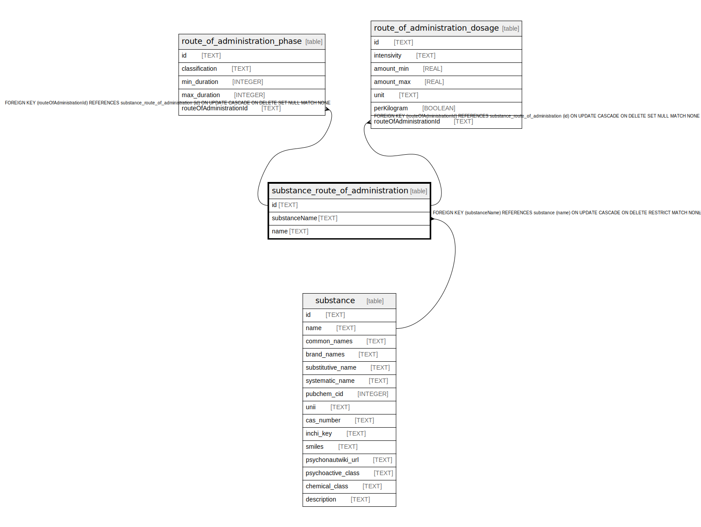

# substance_route_of_administration

## Description

<details>
<summary><strong>Table Definition</strong></summary>

```sql
CREATE TABLE "substance_route_of_administration" (
    "id" TEXT NOT NULL PRIMARY KEY,
    "substanceName" TEXT NOT NULL,
    "name" TEXT NOT NULL,
    CONSTRAINT "substance_route_of_administration_substanceName_fkey" FOREIGN KEY ("substanceName") REFERENCES "substance" ("name") ON DELETE RESTRICT ON UPDATE CASCADE
)
```

</details>

## Columns

| Name | Type | Default | Nullable | Children | Parents | Comment |
| ---- | ---- | ------- | -------- | -------- | ------- | ------- |
| id | TEXT |  | false | [route_of_administration_phase](route_of_administration_phase.md) [route_of_administration_dosage](route_of_administration_dosage.md) |  |  |
| substanceName | TEXT |  | false |  | [substance](substance.md) |  |
| name | TEXT |  | false |  |  |  |

## Constraints

| Name | Type | Definition |
| ---- | ---- | ---------- |
| id | PRIMARY KEY | PRIMARY KEY (id) |
| - (Foreign key ID: 0) | FOREIGN KEY | FOREIGN KEY (substanceName) REFERENCES substance (name) ON UPDATE CASCADE ON DELETE RESTRICT MATCH NONE |
| sqlite_autoindex_substance_route_of_administration_1 | PRIMARY KEY | PRIMARY KEY (id) |

## Indexes

| Name | Definition |
| ---- | ---------- |
| substance_route_of_administration_name_substanceName_key | CREATE UNIQUE INDEX "substance_route_of_administration_name_substanceName_key" ON "substance_route_of_administration"("name", "substanceName") |
| sqlite_autoindex_substance_route_of_administration_1 | PRIMARY KEY (id) |

## Relations



---

> Generated by [tbls](https://github.com/k1LoW/tbls)
