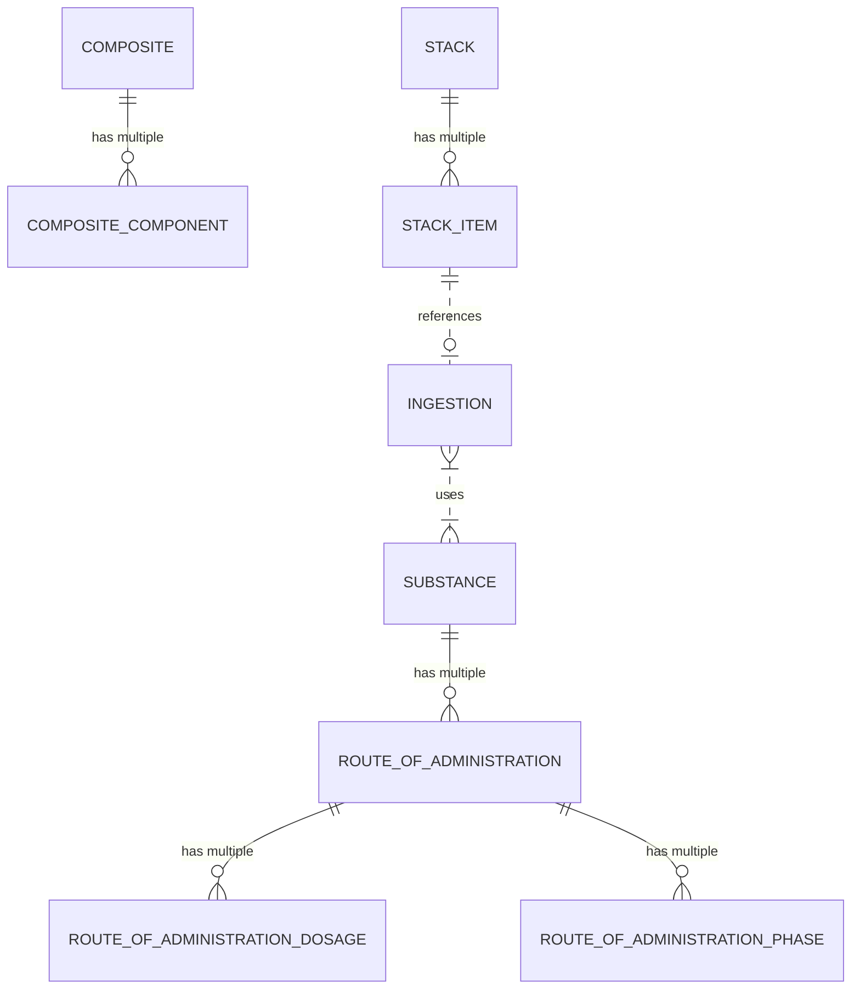

# Product Architecture

- Composite: Defines a preset of multiple ingestions that are used together by ingestion of higher-order substance. Good
  example is a meal, supplement capsules which contain multiple substances or a cocktail.
    - Composite Component: Defines a single ingestion that is part of a composite.
- Stack: Defines a cyclic set of ingestions as of composite. Good example is a stack of supplements that are taken
  together.
    - StackItem: Defines a single ingestion that is part of a stack.
- Inventory: Defines a set of substances that are available for ingestion.
    - InventoryItem: Defines a single substance that is part of an inventory.