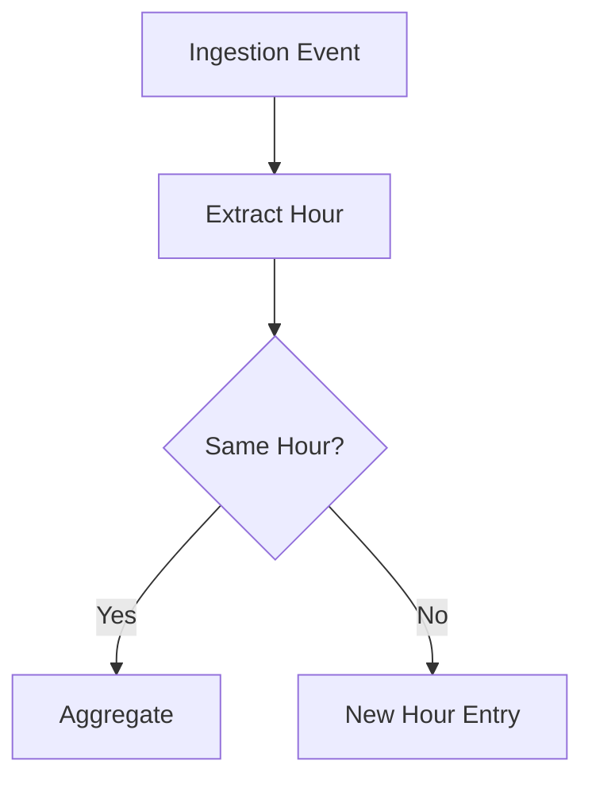

# Hourly Journal Summary Feature Specification

## 1. Overview

### Purpose
The Hourly Journal Summary feature provides a simplified, time-based view of substance ingestion events by aggregating multiple entries into hourly summaries. This approach offers users a clearer understanding of their substance intake patterns and effects over time.

### Rationale
- Reduces cognitive load by consolidating multiple ingestion events
- Provides clear temporal context for substance effects
- Simplifies the visualization of overlapping substances and their phases

## 2. Data Requirements

### Core Data Fields
- Substance name
- Total dosage (aggregated per hour)
- Timestamp (hour-based grouping)
- Current phase
- Phase progress percentage

### Data Sources
- Ingestion logs (`docs/tui/ingestion.md`)
- Phase tracking data (`docs/ingestion-analyzer.md`)
- Report templates (`docs/report.md`)
- UI components (`docs/reference/.widgets/synthetic-widget-design.md`)

## 3. Aggregation Logic

### Time-based Grouping


### Rules for Aggregation
1. **Hourly Grouping**
   - Group all ingestions by their timestamp's hour component
   - Consider user's local timezone for accurate grouping

2. **Multiple Substances**
   - List each substance separately within the hour block
   - Combine identical substances, summing their dosages

3. **Phase Determination**
   - Calculate predominant phase based on:
     - Duration in each phase
     - Phase intensity
     - Transition timing
   - Priority order: Peak > Comeup > Comedown > Onset > Afterglow

## 4. Display & UI/UX Specifications

### Hour Block Format
```
19:00 | Caffeine 20mg (Coming down) [=====>    ] 65%
      | Theanine 100mg (Peak)       [=========>] 90%
```

### Visual Elements
- Hour label (left-aligned)
- Substance summary (substance name, total dosage)
- Phase indicator (current phase in parentheses)
- Progress bar (phase completion)
- Color coding based on phase:
  - Onset: Blue
  - Comeup: Yellow
  - Peak: Green
  - Comedown: Orange
  - Afterglow: Purple

## 5. Integration Points

### Module Integration
- Ingestion Tracker
  - Hook into existing event logging system
  - Maintain backward compatibility

### View Toggles
- Quick switch between:
  - Detailed log view
  - Hourly summary view
  - Combined view (expandable summaries)

## 6. Implementation Considerations

### Data Processing
1. Aggregation Module
   - Real-time aggregation of new ingestions
   - Background processing for historical data
   - Caching strategy for frequent access

2. Testing Strategy
   - Unit Tests:
     - Aggregation logic
     - Phase calculation
     - Time zone handling
   - Integration Tests:
     - UI rendering
     - Data flow
     - View switching
   - Performance Tests:
     - Large dataset handling
     - Real-time updates

## 7. Edge Cases & Future Enhancements

### Edge Cases
1. Incomplete Data
   - Display "Unknown Phase" for missing phase data
   - Use placeholder progress indicators
   - Show warning for partial data

2. Timezone Changes
   - Handle daylight savings transitions
   - Support international date line crossing

### Future Enhancements
1. Smart Aggregation
   - Machine learning for phase prediction
   - Substance interaction awareness

2. Extended Visualization
   - Weekly/monthly summary views
   - Custom time period aggregation
   - Export functionality

## References
- Ingestion Tracking: `docs/tui/ingestion.md`
- Phase Analysis: `docs/ingestion-analyzer.md`
- Reporting System: `docs/report.md`
- UI Components: `docs/reference/.widgets/synthetic-widget-design.md`