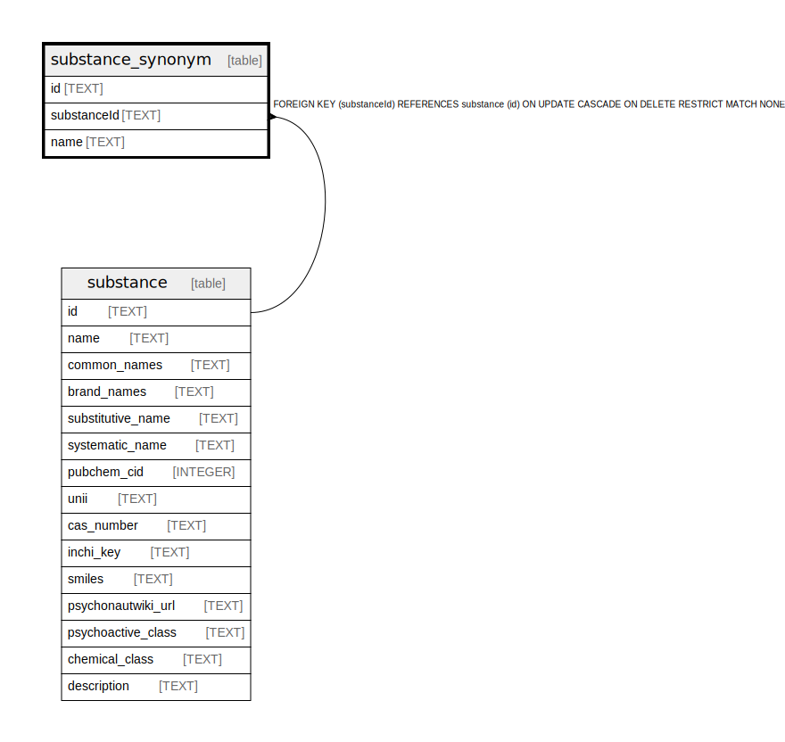

# substance_synonym

## Description

<details>
<summary><strong>Table Definition</strong></summary>

```sql
CREATE TABLE "substance_synonym" (
    "id" TEXT NOT NULL PRIMARY KEY,
    "substanceId" TEXT NOT NULL,
    "name" TEXT NOT NULL,
    CONSTRAINT "substance_synonym_substanceId_fkey" FOREIGN KEY ("substanceId") REFERENCES "substance" ("id") ON DELETE RESTRICT ON UPDATE CASCADE
)
```

</details>

## Columns

| Name | Type | Default | Nullable | Children | Parents | Comment |
| ---- | ---- | ------- | -------- | -------- | ------- | ------- |
| id | TEXT |  | false |  |  |  |
| substanceId | TEXT |  | false |  | [substance](substance.md) |  |
| name | TEXT |  | false |  |  |  |

## Constraints

| Name | Type | Definition |
| ---- | ---- | ---------- |
| id | PRIMARY KEY | PRIMARY KEY (id) |
| - (Foreign key ID: 0) | FOREIGN KEY | FOREIGN KEY (substanceId) REFERENCES substance (id) ON UPDATE CASCADE ON DELETE RESTRICT MATCH NONE |
| sqlite_autoindex_substance_synonym_1 | PRIMARY KEY | PRIMARY KEY (id) |

## Indexes

| Name | Definition |
| ---- | ---------- |
| substance_synonym_name_key | CREATE UNIQUE INDEX "substance_synonym_name_key" ON "substance_synonym"("name") |
| sqlite_autoindex_substance_synonym_1 | PRIMARY KEY (id) |

## Relations



---

> Generated by [tbls](https://github.com/k1LoW/tbls)
