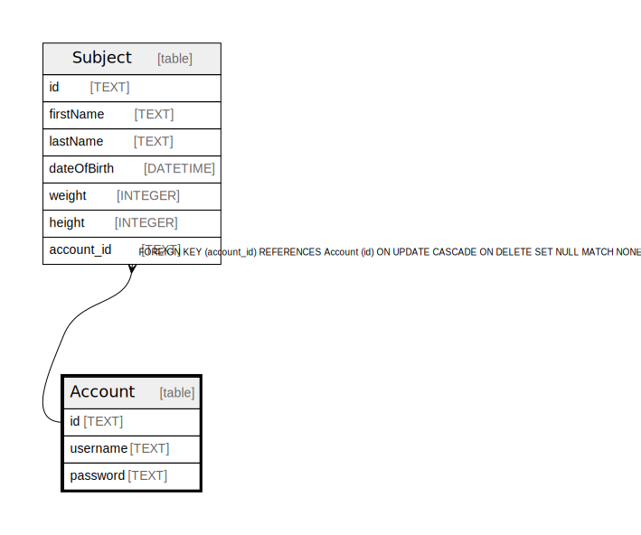

# Account

## Description

<details>
<summary><strong>Table Definition</strong></summary>

```sql
CREATE TABLE "Account" (
    "id" TEXT NOT NULL PRIMARY KEY,
    "username" TEXT NOT NULL,
    "password" TEXT NOT NULL
)
```

</details>

## Columns

| Name | Type | Default | Nullable | Children | Parents | Comment |
| ---- | ---- | ------- | -------- | -------- | ------- | ------- |
| id | TEXT |  | false | [Subject](Subject.md) |  |  |
| username | TEXT |  | false |  |  |  |
| password | TEXT |  | false |  |  |  |

## Constraints

| Name | Type | Definition |
| ---- | ---- | ---------- |
| id | PRIMARY KEY | PRIMARY KEY (id) |
| sqlite_autoindex_Account_1 | PRIMARY KEY | PRIMARY KEY (id) |

## Indexes

| Name | Definition |
| ---- | ---------- |
| Account_username_key | CREATE UNIQUE INDEX "Account_username_key" ON "Account"("username") |
| sqlite_autoindex_Account_1 | PRIMARY KEY (id) |

## Relations



---

> Generated by [tbls](https://github.com/k1LoW/tbls)
