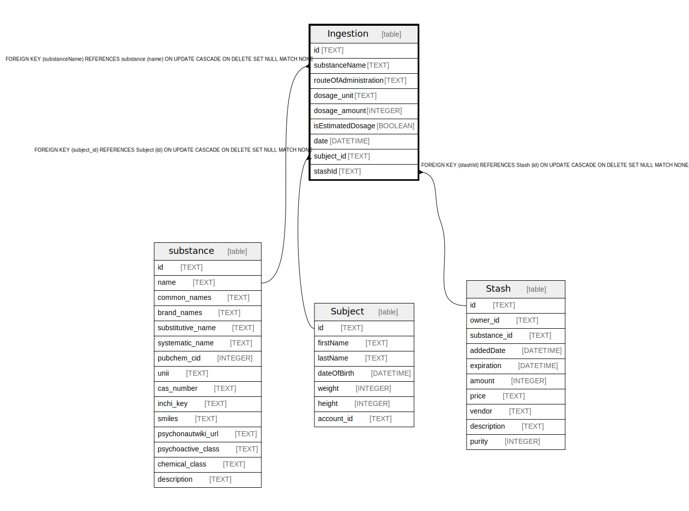

# Ingestion

## Description

<details>
<summary><strong>Table Definition</strong></summary>

```sql
CREATE TABLE "Ingestion" (
    "id" TEXT NOT NULL PRIMARY KEY,
    "substanceName" TEXT,
    "routeOfAdministration" TEXT,
    "dosage_unit" TEXT,
    "dosage_amount" INTEGER,
    "isEstimatedDosage" BOOLEAN DEFAULT false,
    "date" DATETIME,
    "subject_id" TEXT,
    "stashId" TEXT,
    CONSTRAINT "Ingestion_subject_id_fkey" FOREIGN KEY ("subject_id") REFERENCES "Subject" ("id") ON DELETE SET NULL ON UPDATE CASCADE,
    CONSTRAINT "Ingestion_substanceName_fkey" FOREIGN KEY ("substanceName") REFERENCES "substance" ("name") ON DELETE SET NULL ON UPDATE CASCADE,
    CONSTRAINT "Ingestion_stashId_fkey" FOREIGN KEY ("stashId") REFERENCES "Stash" ("id") ON DELETE SET NULL ON UPDATE CASCADE
)
```

</details>

## Columns

| Name | Type | Default | Nullable | Children | Parents | Comment |
| ---- | ---- | ------- | -------- | -------- | ------- | ------- |
| id | TEXT |  | false |  |  |  |
| substanceName | TEXT |  | true |  | [substance](substance.md) |  |
| routeOfAdministration | TEXT |  | true |  |  |  |
| dosage_unit | TEXT |  | true |  |  |  |
| dosage_amount | INTEGER |  | true |  |  |  |
| isEstimatedDosage | BOOLEAN | false | true |  |  |  |
| date | DATETIME |  | true |  |  |  |
| subject_id | TEXT |  | true |  | [Subject](Subject.md) |  |
| stashId | TEXT |  | true |  | [Stash](Stash.md) |  |

## Constraints

| Name | Type | Definition |
| ---- | ---- | ---------- |
| id | PRIMARY KEY | PRIMARY KEY (id) |
| - (Foreign key ID: 0) | FOREIGN KEY | FOREIGN KEY (stashId) REFERENCES Stash (id) ON UPDATE CASCADE ON DELETE SET NULL MATCH NONE |
| - (Foreign key ID: 1) | FOREIGN KEY | FOREIGN KEY (substanceName) REFERENCES substance (name) ON UPDATE CASCADE ON DELETE SET NULL MATCH NONE |
| - (Foreign key ID: 2) | FOREIGN KEY | FOREIGN KEY (subject_id) REFERENCES Subject (id) ON UPDATE CASCADE ON DELETE SET NULL MATCH NONE |
| sqlite_autoindex_Ingestion_1 | PRIMARY KEY | PRIMARY KEY (id) |

## Indexes

| Name | Definition |
| ---- | ---------- |
| sqlite_autoindex_Ingestion_1 | PRIMARY KEY (id) |

## Relations



---

> Generated by [tbls](https://github.com/k1LoW/tbls)
