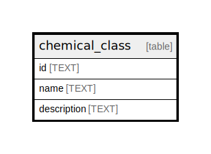

# chemical_class

## Description

<details>
<summary><strong>Table Definition</strong></summary>

```sql
CREATE TABLE "chemical_class" (
    "id" TEXT NOT NULL PRIMARY KEY,
    "name" TEXT NOT NULL,
    "description" TEXT
)
```

</details>

## Columns

| Name | Type | Default | Nullable | Children | Parents | Comment |
| ---- | ---- | ------- | -------- | -------- | ------- | ------- |
| id | TEXT |  | false |  |  |  |
| name | TEXT |  | false |  |  |  |
| description | TEXT |  | true |  |  |  |

## Constraints

| Name | Type | Definition |
| ---- | ---- | ---------- |
| id | PRIMARY KEY | PRIMARY KEY (id) |
| sqlite_autoindex_chemical_class_1 | PRIMARY KEY | PRIMARY KEY (id) |

## Indexes

| Name | Definition |
| ---- | ---------- |
| chemical_class_name_key | CREATE UNIQUE INDEX "chemical_class_name_key" ON "chemical_class"("name") |
| sqlite_autoindex_chemical_class_1 | PRIMARY KEY (id) |

## Relations



---

> Generated by [tbls](https://github.com/k1LoW/tbls)
