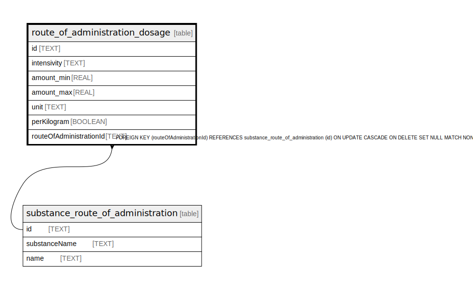

# route_of_administration_dosage

## Description

<details>
<summary><strong>Table Definition</strong></summary>

```sql
CREATE TABLE "route_of_administration_dosage" (
    "id" TEXT NOT NULL PRIMARY KEY,
    "intensivity" TEXT NOT NULL,
    "amount_min" REAL NOT NULL,
    "amount_max" REAL NOT NULL,
    "unit" TEXT NOT NULL,
    "perKilogram" BOOLEAN NOT NULL DEFAULT false,
    "routeOfAdministrationId" TEXT,
    CONSTRAINT "route_of_administration_dosage_routeOfAdministrationId_fkey" FOREIGN KEY ("routeOfAdministrationId") REFERENCES "substance_route_of_administration" ("id") ON DELETE SET NULL ON UPDATE CASCADE
)
```

</details>

## Columns

| Name | Type | Default | Nullable | Children | Parents | Comment |
| ---- | ---- | ------- | -------- | -------- | ------- | ------- |
| id | TEXT |  | false |  |  |  |
| intensivity | TEXT |  | false |  |  |  |
| amount_min | REAL |  | false |  |  |  |
| amount_max | REAL |  | false |  |  |  |
| unit | TEXT |  | false |  |  |  |
| perKilogram | BOOLEAN | false | false |  |  |  |
| routeOfAdministrationId | TEXT |  | true |  | [substance_route_of_administration](substance_route_of_administration.md) |  |

## Constraints

| Name | Type | Definition |
| ---- | ---- | ---------- |
| id | PRIMARY KEY | PRIMARY KEY (id) |
| - (Foreign key ID: 0) | FOREIGN KEY | FOREIGN KEY (routeOfAdministrationId) REFERENCES substance_route_of_administration (id) ON UPDATE CASCADE ON DELETE SET NULL MATCH NONE |
| sqlite_autoindex_route_of_administration_dosage_1 | PRIMARY KEY | PRIMARY KEY (id) |

## Indexes

| Name | Definition |
| ---- | ---------- |
| route_of_administration_dosage_intensivity_routeOfAdministrationId_key | CREATE UNIQUE INDEX "route_of_administration_dosage_intensivity_routeOfAdministrationId_key" ON "route_of_administration_dosage"("intensivity", "routeOfAdministrationId") |
| sqlite_autoindex_route_of_administration_dosage_1 | PRIMARY KEY (id) |

## Relations



---

> Generated by [tbls](https://github.com/k1LoW/tbls)
